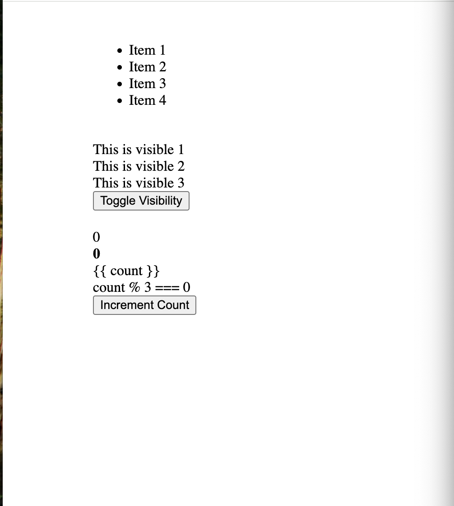
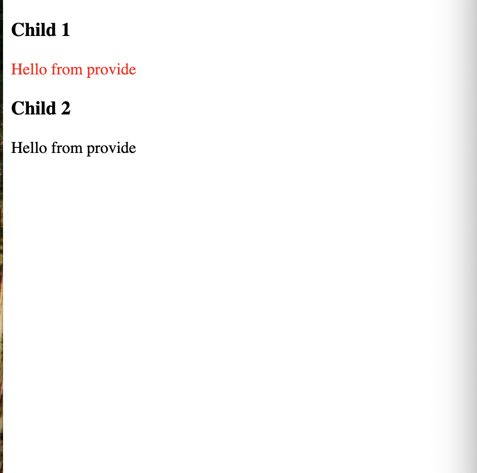
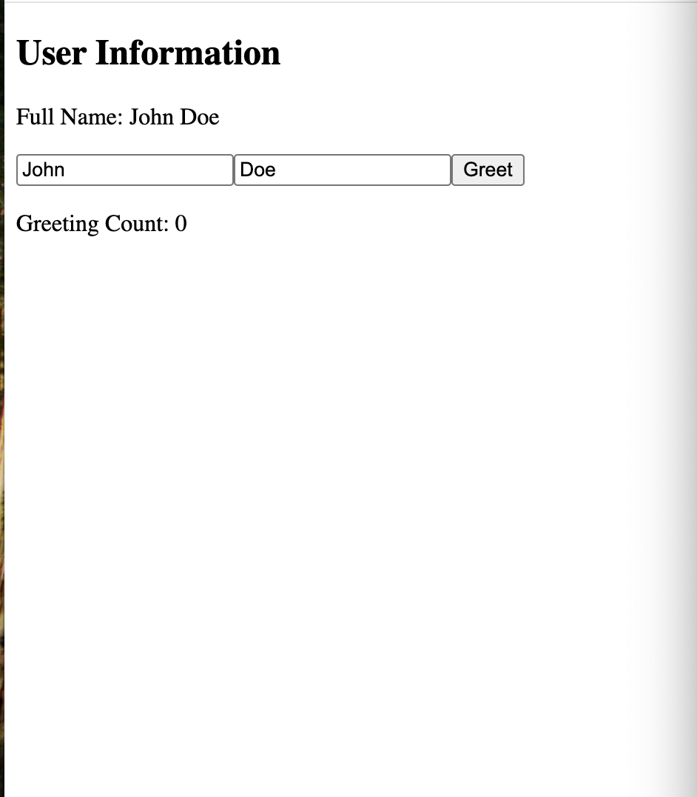
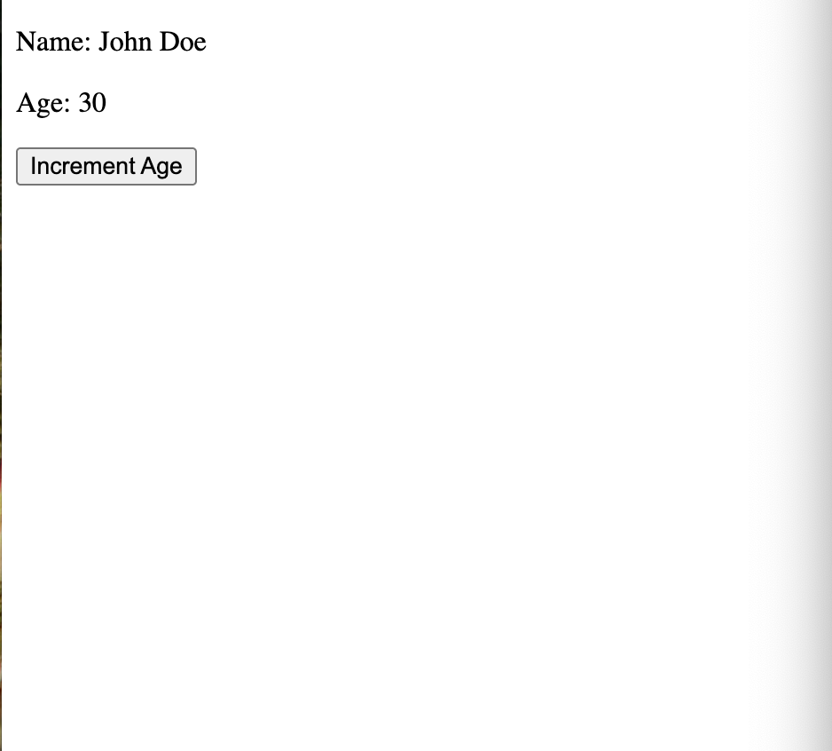

# vue-demo

## Project setup
```
npm install
```

### Compiles and hot-reloads for development
```
npm run serve
```

### Compiles and minifies for production
```
npm run build
```

### Lints and fixes files
```
npm run lint
```

### ESLint 설정 참고
- `<script setup>`에서 사용하는 `defineProps`, `defineEmits`, `defineExpose`, `withDefaults` 같은 Vue 매크로는 빌드 타임에만 존재하므로 ESLint가 기본적으로 알지 못합니다.
- `.eslintrc.js`의 `globals`에 위 매크로를 `readonly` 로 선언해 두었으니, 별도 임포트 없이도 린트 오류 없이 사용할 수 있습니다.

### 예제 이미지 매핑
| 컴포넌트 | 이미지 |
| --- | --- |
| E-01-instance |  |
| E-02-reactive |  |
| E-03-binding |  |
| E-04-directives |  |
| E-05-ParentComponent |  |
| E-06-ParentComponent |  |
| E-07-Options-API |  |
| E-08-composition-api |  |
| E-09-composition-API2 |  |
| E-10-ref |  |
| E-11-reactive |  |
| E-12-ref-component |  |

### Customize configuration
See [Configuration Reference](https://cli.vuejs.org/config/).

## Vue 3 스타일 전환 요약
- 모든 `.vue` 파일을 `<script setup>` 기반 Composition API 구조로 재작성하여 Vue 3스러운 코드베이스로 통일했습니다. (필요한 경우 기존 컴포넌트명은 `<script>` 블록으로 유지)
- Options API에서 사용하던 `data`, `computed`, `methods`, `watch`, `provide/inject` 는 각각 `ref/reactive`, `computed`, 일반 함수, `watch`, `provide/inject` 훅으로 옮겼고 라이프사이클 훅은 `onXXX` 조합을 사용하도록 변경했습니다.
- `E-07 ~ E-09` 컴포넌트는 `defineProps`/`withDefaults`/`toRef`를 활용해 props를 정의하고, 외부에서 접근 가능한 메서드는 `defineExpose`로 노출해 기존 동작을 그대로 유지했습니다.
- `example6` 디렉터리의 컴포넌트들도 Composition API + TypeScript로 정리하여 DOM ref와 상태 타입을 명시했습니다.
- `npm run build` 로 프로덕션 빌드를 수행해 변경 사항이 정상적으로 컴파일되는 것을 확인했습니다.
